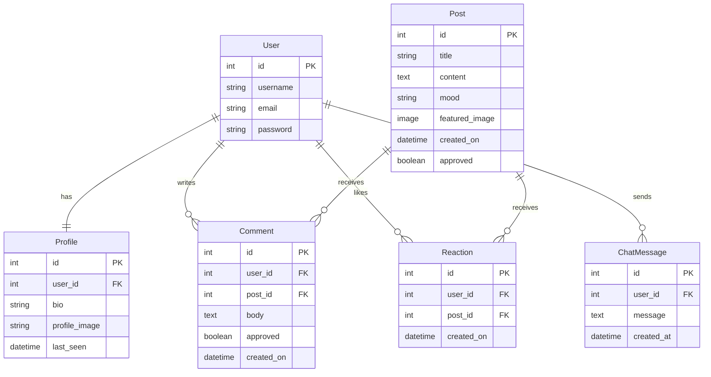

# CatsCurios

A playful Django web application documenting the daily adventures of a curious cat through blog-style entries, interactive reactions, and live community features.

Live Site: (https://catscurios-aa2feb00a994.herokuapp.com/)
Repository: (https://github.com/rikity432/CatsCurios)

📖 Project Overview

Cats Curios is a full-stack Django application built as a final capstone project during a 16-week programming skills bootcamp.

The platform allows users to follow a fictional cat’s daily experiences, interact through comments and reactions, and participate in a live chat environment.

The project demonstrates modern full-stack development practices including authentication, database design, AJAX interactions, and deployment.

🎯 Project Goals

Build a full CRUD Django application

Implement authentication & user profiles

Demonstrate relational database design

Use AJAX for dynamic UI updates

Deploy a production-ready application

✨ Features
Core Features

Admin-created blog posts

User registration & login

User profiles with images

Comment system with admin approval

Mood filtering & pagination

Interactive Features

AJAX like/reaction system

Live chat with profanity filtering

Cat status indicator (dynamic navbar)

Online users tracker

Mood analytics chart (Chart.js)

🧱 Technology Stack
Frontend

HTML5

CSS3

Bootstrap

JavaScript (AJAX)

Chart.js

Backend

Python

Django

PostgreSQL

Deployment & Tools

Heroku

Cloudinary

GitHub

Crispy Forms

🗄 Database Design
Entity Relationship Diagram

🧠 Agile Development

Project planning followed Agile principles:

User stories tracked via GitHub Projects

Iterative feature delivery

🚀 Deployment

Application deployed using Heroku:

PostgreSQL database configured

Cloudinary media storage enabled

Environment variables secured

Static files collected via WhiteNoise

🧪 Testing

Manual testing performed with Dev tools and inbuilt Lighthouse, HTML validator with https://validator.w3.org/ CSS validation with https://jigsaw.w3.org/css-validator/ across:

Authentication flows

Comment moderation

AJAX interactions

Mobile responsiveness

🔮 Future Improvements

WebSocket real-time chat (implemented!)

Follow favourite users

Cat achievement badges

Notification system

Cat location tracker

👨‍💻 Author

Created as a capstone portfolio project demonstrating Django full-stack development skills.

Source credits:

Background image from: <a href="https://www.freepik.com/free-vector/modern-abstract-dark-violate-pink-background_159480816.htm#fromView=keyword&page=1&position=1&uuid=3eb7d263-64db-414b-93b0-d8ffce92635c&query=Modern+background">Image by muhammad.abdullah on Freepik</a>

Favicon from: https://www.favicon.cc/?action=icon&file_id=1020267

Blog post images created with Google Gemini image creator "Nano Banana Pro": https://gemini.google/overview/image-generation/

