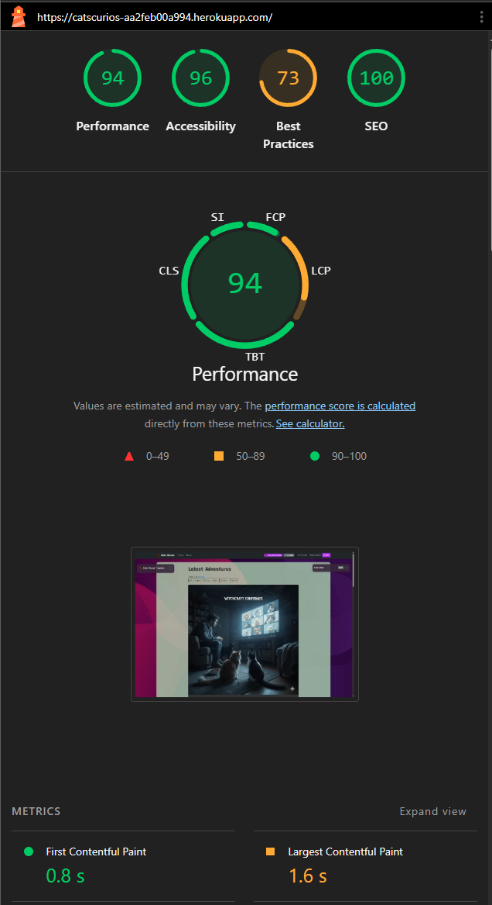
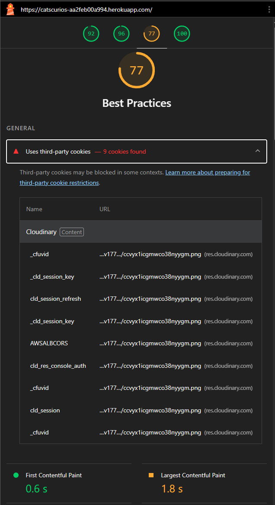
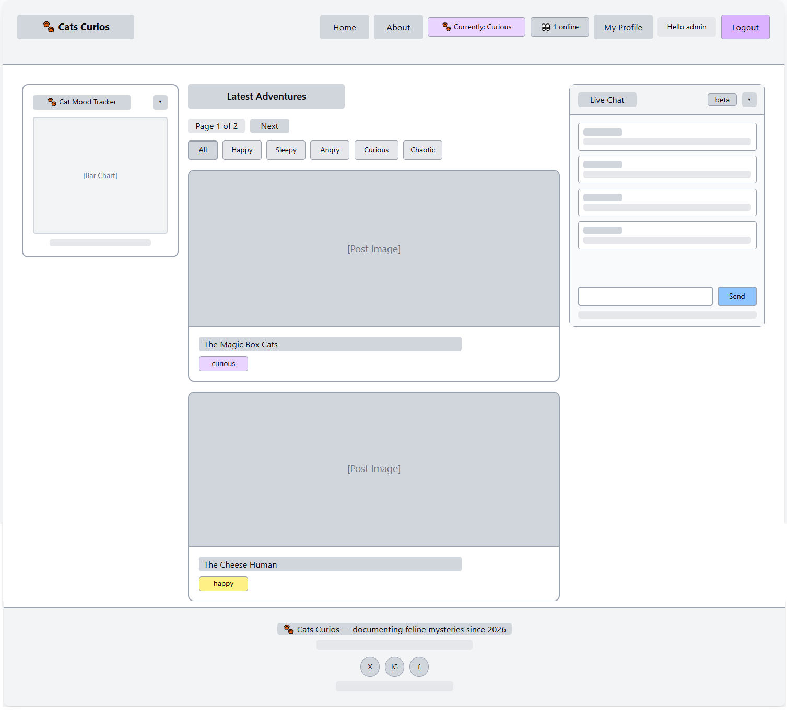

# CatsCurios

A playful Django web application documenting the daily adventures of a curious cat through blog-style entries, interactive reactions, and live community features.

Live Site: https://catscurios-aa2feb00a994.herokuapp.com/
Repository: https://github.com/rikity432/CatsCurios

## Table of Contents

- [Project Overview](#project-overview)
- [Project Goals](#project-goals)
- [Features](#features)
- [Technology Stack](#technology-stack)
- [Database Design](#database-design)
- [Agile Development](#agile-development)
- [Deployment](#deployment)
- [Testing](#testing)
- [Future Improvements](#future-improvements)
- [Author](#author)
- [Source Credits](#source-credits)

<a id="project-overview"></a>
## 📖 Project Overview

Cats Curios is a full-stack Django application built as a final capstone project during a 16-week programming skills bootcamp.

The platform allows users to follow a fictional cat’s daily experiences, interact through comments and reactions, and participate in a live chat environment.

The project demonstrates modern full-stack development practices including authentication, database design, AJAX interactions, and deployment.

<a id="project-goals"></a>
## 🎯 Project Goals


- Build a full CRUD Django application
- Implement authentication & user profiles
- Demonstrate relational database design
- Use AJAX for dynamic UI updates
- Deploy a production-ready application

<a id="features"></a>
## ✨ Features

### Core Features

Admin-created blog posts

User registration & login

User profiles with images

Comment system with admin approval

Mood filtering & pagination

### Interactive Features

AJAX like/reaction system

Live chat with profanity filtering

Cat status indicator (dynamic navbar)

Online users tracker

Mood analytics chart (Chart.js)

<a id="technology-stack"></a>
## 🧱 Technology Stack

### Frontend

HTML5

CSS3

Bootstrap

JavaScript (AJAX)

Chart.js

### Backend

Python

Django

PostgreSQL

### Deployment & Tools

Heroku

Cloudinary

GitHub

Crispy Forms

<a id="database-design"></a>
## 🗄 Database Design

### Entity Relationship Diagram

```mermaid
erDiagram

    User ||--|| Profile : has
    User ||--o{ Comment : writes
    User ||--o{ Reaction : likes
    User ||--o{ ChatMessage : sends

    Post ||--o{ Comment : receives
    Post ||--o{ Reaction : receives

    User {
        int id PK
        string username
        string email
        string password
    }

    Profile {
        int id PK
        int user_id FK
        string bio
        string profile_image
        datetime last_seen
    }
    <a id="agile-development"></a>
    ## 🧠 Agile Development
    Post {
        int id PK
        string title
        text content
        string mood
        image featured_image
        datetime created_on
    <a id="deployment"></a>
    ## 🚀 Deployment
    }

    Comment {
        int id PK
        int user_id FK
        int post_id FK
        text body
        boolean approved
        datetime created_on
    }

    <a id="testing"></a>
    ## 🧪 Testing
        int id PK
    Manual testing performed with Dev tools and inbuilt Lighthouse, HTML validator (https://validator.w3.org/) and CSS validation (https://jigsaw.w3.org/css-validator/) across:
        int post_id FK
        datetime created_on
    }

    ChatMessage {
        int id PK
        int user_id FK
        text message

    ### Validator & Lighthouse Results

    
    
    
    

    ### Wireframes

    
    
    
        datetime created_at
    <a id="future-improvements"></a>
    ## 🔮 Future Improvements
```

🧠 Agile Development

Project planning followed Agile principles:

User stories tracked via GitHub Projects

Iterative feature delivery

🚀 Deployment
    <a id="author"></a>
    ## 👨‍💻 Author
Application deployed using Heroku:

PostgreSQL database configured
    <a id="source-credits"></a>
    ## Source Credits
Cloudinary media storage enabled

Environment variables secured

Static files collected via WhiteNoise


Authentication flows

Comment moderation

AJAX interactions

Mobile responsiveness

🔮 Future Improvements

WebSocket real-time chat (implemented!)

Follow favourite users

Cat achievement badges

Notification system

Cat location tracker

👨‍💻 Author

Created as a capstone portfolio project demonstrating Django full-stack development skills.

Source credits:

Background image from: <a href="https://www.freepik.com/free-vector/modern-abstract-dark-violate-pink-background_159480816.htm#fromView=keyword&page=1&position=1&uuid=3eb7d263-64db-414b-93b0-d8ffce92635c&query=Modern+background">Image by muhammad.abdullah on Freepik</a>

Favicon from: https://www.favicon.cc/?action=icon&file_id=1020267

Blog post images created with Google Gemini image creator "Nano Banana Pro": https://gemini.google/overview/image-generation/

